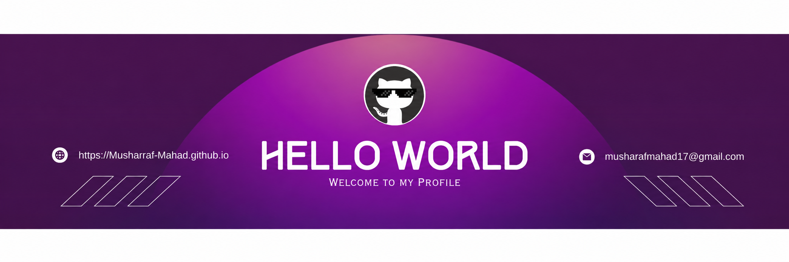

<!-- ============================================ -->
<!--          MUSHARRAF MAHAD PROFILE            -->
<!-- ============================================ -->

<!-- Profile Banner -->

  

<!-- Introduction -->

<h1 align="center">Hi 👋, I'm Musharraf Mahad</h1>

<h3 align="center">
  Full Stack AI Engineer | MERN Stack Developer
</h3>

  

---

<!-- Connect With Me -->

<h2 align="center">🤝 Connect With Me</h2>

  
  
  
  
  

  📧 <b>Email:</b> musharrafmahad17@gmail.com

---

## 👨‍💻 About Me

I'm **Musharraf Mahad**, a Software Engineering student and aspiring **Full Stack AI Engineer** passionate about building modern web applications and intelligent software solutions.

My primary focus is **MERN Stack development and Artificial Intelligence**, combining frontend, backend, databases, and emerging AI technologies to create practical applications.

- 🎓 Software Engineer.
- 💻 MERN Stack Developer.
- 🤖 Passionate about Artificial Intelligence and AI Agents.
- 🌐 Building full-stack web applications.
- 🚀 Exploring AI-powered software solutions.
- 🎯 Goal: Become a professional Full Stack AI Engineer.

---

## 🛠️ Skills & Technologies

### 💻 Programming Languages

  
  
  
  

### 🎨 Frontend Development

  
  
  
  

### ⚙️ MERN Stack & Backend

  
  
  
  

### 🗄️ Databases & Backend Services

  
  

- MongoDB
- Firebase
- Cloud Firestore

### 🔧 Version Control

  
  

### 🤖 Artificial Intelligence

- AI Agents
- AI-powered applications
- Exploring LLM-based development
- Prompt Engineering
---

<!-- Quick Info -->

<h2 align="center">⚡ Quick Info</h2>

  💻 <b>MERN Stack Developer</b> &nbsp; | &nbsp; 🤖 <b>AI Engineer</b>

  🚀 Available for Collaboration, Freelance Projects & Internship Opportunities

  <b>Let's build something amazing together! 🔥</b>

---

  Thanks for visiting my profile! ⭐

